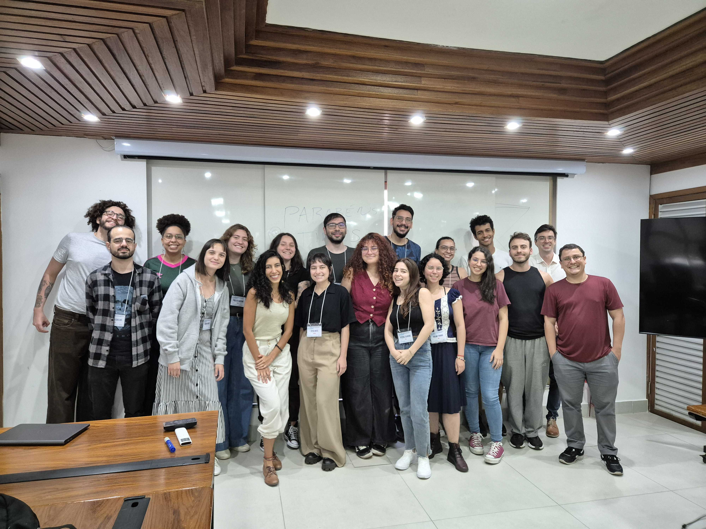

# Afterthoughts

A Escola de Computação e IA do CBPF foi minha primeira oportunidade enquanto físico profissional de exercer uma atividade de ensino.

## Formato

A proposta da escola foi de ter palestras e cursos teóricos na parte da manhã, e cursos práticos (*hands-on*) na parte da tarde. Os cursos práticos englobaram alguns temas:

- Astrofísica e Cosmologia Computacional (o que eu participei)

    - Os participantes explorarão dados de imagem e outros observáveis para construir estatísticas, entender simulações cosmológicas e como extrair informações, além de trabalhar com métodos de estado-da-arte.

- Fundamentos estatísticos em Física Computacional e aplicações

    - Esse curso explora os princípios estatísticos que guiam a física computacional e aplicações, examinando a interação entre métodos estatísticos e ferramentas computacionais na análise de sistemas físicos complexos e aprendizado de máquina.

- Métodos Computacionais em Física de Altas Energias

    - Esse curso oferece uma exploração de técnicas usadas em detectores de partículas e física de altas energias. Participantes irão explorar simulações de detectores, análise de dados e métodos avançados, incluindo o uso de aprendizado de máquina.

- Geofísica com Inteligência Artificial

    - O curso abordará o uso de inteligência artificial para a resolução de problemas complexos em geofísica, como a construção de modelos de velocidade de subsuperfície. Os participantes usarão técnicas como redes neurais baseadas em física (PINNs) e outros para conectar os dados sísmicos com modelos de velocidade.

- Computação Quântica

    - O curso oferece uma visão geral sobre princípios e aplicações da computação quãntica, em comparação com a clássica, enfatizando seu potencial de resolver problemas complexos. Os participantes explorarão algoritmos quânticos e suas aplicações, além de terem contato com o novo ramo do aprendizando de máquina quântico.

Os alunos, no ato da inscrição, podiam escolher o curso desejado. Para nossa surpresa, o curso de Cosmologia foi o curso mais procurado com folga, com 15 alunos no último dia de curso.

## A Ideia

A nossa ideia foi de gerar três mapas diferentes: um da temperatura da CMB, um de lenteamento de galáxias, e outro de densidade de galáxias. No primeiro dia de curso, a Gabriela ensinou a extrair o espectro de potências angular ($C_\ell$) dos mapas. Nos dois dias seguintes, o Guilherme ensinou a fornecer previsões teóricas para o espectro de potências angular. No último dia, eu ensinei a confrontar dados e teoria utilizando MCMCs, a fim de obter vínculos quantitativos para os parâmetros cosmológicos.

## A Preparação

Talvez a parte mais difícil da preparação foi o fato de que a Gabriela utilizou o `CAMB.sources` para simular os mapas, enquanto o Guilherme utilizou o `CLASS` para fornecer previsões teóricas. Nós nos estressamos coletivamente tentando compatibilizar os dois códigos, até que decidimos também usar o `CLASS` para gerar os mapas.

Outra dificuldade no preparo do curso foi fazer uma MCMC ser viável para que os alunos pudessem rodar em seus computadores pessoais. Eu fiz um código simples de MCMC (`MCMC_supernovas.ipynb`) que não leva em conta várias otimizações modernas como paralelização e *fast-slow splitting*. A primeira aproximação que fizemos foi variar apenas dois parâmetros cosmológicos: $\Omega_m$ e $\sigma_8$. Mesmo assim, a cadeia ainda demorava para rodar: antes da aula, eu deixei a noite inteira rodando até a convergência.

O código em si não é lento: o `CLASS` roda em cerca de 1-3 segundos no meu computador. Para dois parâmetros, a convergência precisava de cerca de 1000 amostras. A maior dificuldade então era a taxa de aceitação da cadeia. Foi então que eu tive a ideia: se tivermos uma matriz de covariância, podemos utilizá-la no proposal da chain, melhorando a taxa de aceitação. Convenientemente, o Guilherme fez uma atividade de matriz de Fisher no curso dele. Os alunos portanto podiam usar a covariância obtida através de Fisher. Por precaução, eu quis computar as covariâncias previamente, caso algum grupo não tivesse conseguido.

Com a covariância, as chains convergiram (R-1 < 0.02) em cerca de meia hora no meu computador. Por precaução novamente, rodei todas as chains previamente, para que os alunos que não conseguissem rodar a MCMC pudessem obter a cadeia e plotar seus resultados.

## As Aulas

Participei das duas últimas aulas, na quinta-feira e sexta-feira. Na quinta, eu apenas observei os alunos tentando computar a matriz de Fisher, oferecendo ajuda quando preciso. Na aula da sexta, com um prazo de 1h30min para obter os resultados finais, expliquei aspectos de análise Bayesiana de dados e deixei os alunos rodando as MCMCs. Já tinha deixado os notebooks todos prontos para que eles apenas encaixassem algumas peças.

Todos os grupos conseguiram rodar suas MCMCs. Apenas o grupo de lenteamento não conseguiu uma convergência muito boa da cadeia. Vale ressaltar que o lenteamento de galáxias foi a sonda mais difícil de preparar, uma vez que o `CLASS` precisava de um $\ell_\mathrm{max}$ muito alto para fornecer previsões precisas. No fim, os alunos fizeram uma apresentação que resumiu todas as aulas e o que eles fizeram.

## Alguns detalhes

- O curso de Cosmologia foi o mais procurado. O segundo foi o de computação quântica, que também contou com participantes de fora da física. No curso de Cosmologia, os alunos eram todos do mestrado ou começo de doutorado. Cosmologia não é a área mais famosa da física, mas é uma área grande e que atrai muitos alunos.

- Dos 15 alunos, 10 eram mulheres. Isso contrasta com os outros cursos onde a grande maioria dos participantes foram homens. Por mais que tenha sido algo isolado, me deixa feliz ver uma maior presença de mulheres na pós-graduação. Eu associo esse dado à presença da professora Gabriela, uma voz ativa no CBPF e que tomou a frente do curso.

- Todos os alunos mostraram uma boa proficiência em Python, usando Jupyter notebooks. Mesmo havendo uma dispersão na experiência dos alunos, o formato em grupos favoreceu a troca de conhecimento e técnicas entre eles.

## Finalmentes

Fiquei muito feliz em participar da primeira Escola de Computação e IA do CBPF. Tive uma ótima experiência e acredito que os alunos conseguiram absorver bastante conhecimento mesmo com um ritmo intenso de aulas. Aprendi muita coisa no processo e espero que os alunos levem essa experiência ao longo das suas carreiras.

Gostaria de agradecer ao Felipe Falciano, à Gabriela Marques e ao Guilherme Brando pela oportunidade e confiança.